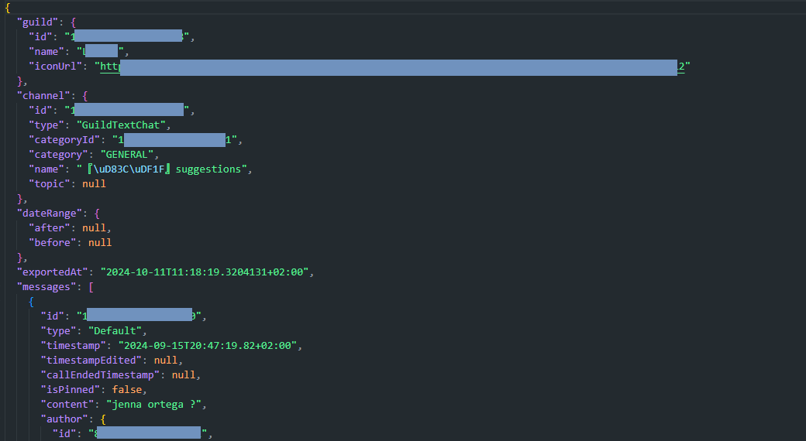
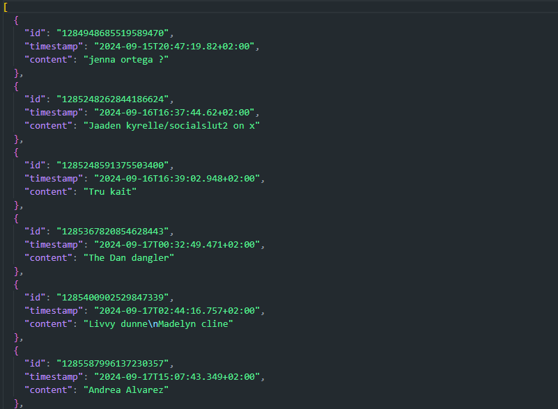

# Fluffy-Artefacts
 Outil qui lit un fichier JSON contenant des messages, extrait certaines informations et les enregistre dans un nouveau fichier JSON Anonymisé. Le nom du fichier de sortie inclut un nombre aléatoire pour éviter les collisions.

## Fonctionnalités

- **Lecture d'un fichier JSON d'entrée** contenant des messages.
- **Extraction d'informations spécifiques** : ID, pseudo, horodatage et contenu de chaque message.
- **Génération de fichiers de sortie** avec un nom unique basé sur un nombre aléatoire.

## Prérequis

- Node.js installé sur votre machine.
- Avoir le fichier `artefact.json` dans le même dossier `Artefacts`.

## Exemple & Résultat
### Artefact (Exemple : Capture Data d'un Discord problématique via un autre script non public):

### Résultat (Exemple : Ce sont les ID des messages):

# Clause de non-responsabilité :
Les outils et scripts présentés ici sont fournis à des fins éducatives et informatives. Leur utilisation se fait à vos propres risques. L’auteur·ice ne peut être tenu·e responsable de tout dommage, perte de données ou violation de sécurité résultant de leur utilisation. Veillez à tester ces outils dans un environnement sécurisé et à respecter les lois et réglementations en vigueur dans votre juridiction. L’utilisation non autorisée de ces outils peut contrevenir à la législation locale ou internationale.

## License
Ce projet est sous licence MIT. Consultez le fichier [LICENSE](https://github.com/PotiteBulle/Fluffy-Artefacts/blob/main/LICENSE) pour plus de détails.
